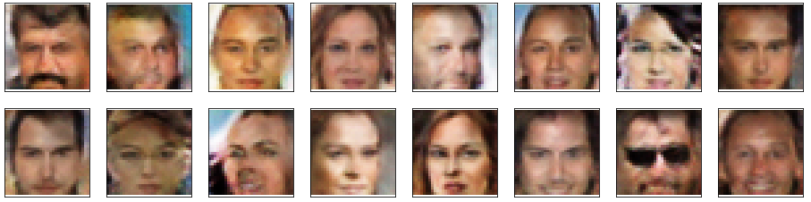

# A Deep Convolutional GAN that yields realistic images

This notebook is part of the Udacity Deep Learning Nanodegree and it is based from one of their notebooks!

In this project, it is showcased the development of a DCGAN, being composed of a generator and discriminator using convolutional and transpose layers. The model is trained on the CelebA dataset that has been pre-processed to have the faces cropped. More information can be found in the notebook.

The model's goal is to get a generator network to generate new images of faces that look as realistic as possible.

If there are some changes or any ML blasphemies that I committed here and there, feel free to open an issue and point me to the right direction! I'm just learning after all! :smile:

## Example output
The output of this model should produce rather realistic images like the ones that it was trained on. Perhaps more epochs could make a difference to yield more interesting and realistic results but it suffices as a proof of concept.

##### Awesome references
PyTorch and Google have some *amazing* references describing GANs and even implementing these.
* The [Discriminator](https://developers.google.com/machine-learning/gan/discriminator) by Google
* The [Generator](https://developers.google.com/machine-learning/gan/generator) by Google
* [DCGAN faces](https://pytorch.org/tutorials/beginner/dcgan_faces_tutorial.html) walkthrough by PyTorch with great starting hyperparameters.
* [Differences between GANs](https://towardsdatascience.com/gan-objective-functions-gans-and-their-variations-ad77340bce3c), including different loss functions.

## License

